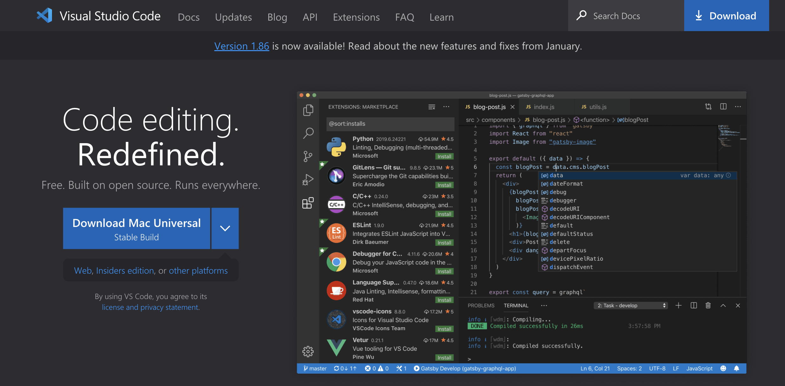
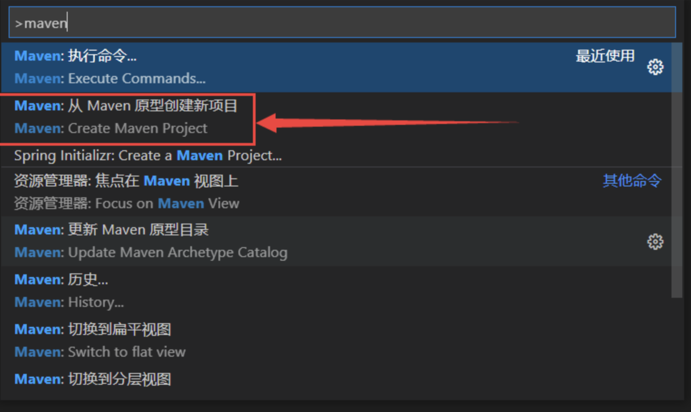
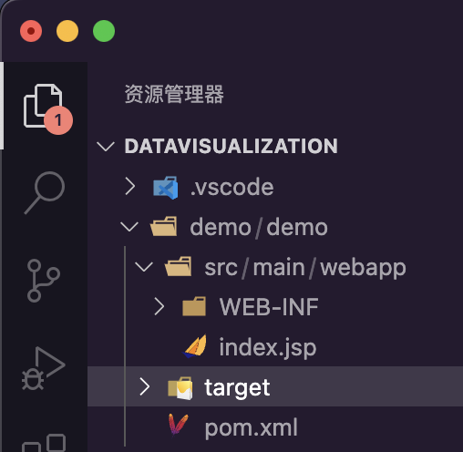
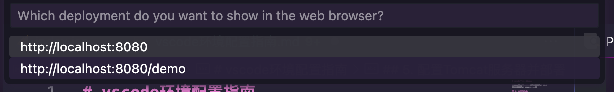

# vscode环境配置指南

本指南只适用于基于ARM架构的Mac os\n
X86架构的Mac os请自行尝试

## 1. 安装VSCode

访问网页：<https://code.visualstudio.com/>

点击左侧download Mac Universal，即可下载

## 2. 安装VSCode插件

在插件市场中搜索，第一个就是Extension Pack for Java，内置了6个依赖插件，直接一键安装即可。然后是热部署插件，市场搜索Deploy安装即可。最后是Tomcat服务器插件，因为之前的Tomcat for Java被弃用了，官方推荐使用Community Server Connectors来进行代替，同样是搜索安装即可。就是下图的这三个插件。


## 3. 通过homebrew安装JDK与maven

1. 安装JDK
在终端中输入：

> brew install oracle-jdk --cask

输入Mac 密码后，安装完成。
在终端输入：
> java -version
得到以下结果，表示安装成功。

注：使用homebrew安装JDK时，会自动将JDK的环境变量配置到~/.zshrc中，所以不需要手动配置环境变量。且默认下载的为最新版本的JDK，无需手动指定版本号。若需要特定版本的JDK，如JDK8，请自行安装。

2. 安装maven

在终端中输入：
> brew install maven

安装配置完成后，输入：
> mvn -version
> 
> 即为安装成功。

## 4. 创建web项目

按住键盘上的⇧+⌘+p然后输入maven

点击webapp

随后一路回车
得到如下文件目录结构，初次建立可能没有target项是正常的。


### 4.1运行web项目

按住键盘上的⇧+⌘+p然后输入maven，选择执行，再选再选择package，等待vs code加载


## 5. 配置Tomcat服务器并部署

如图所示

 然后会询问你是否下载服务器，如果本机没有Tomcat的话就点击yes，然后选择对应版本下载就好了。
 也可以使用homebrew安装，然后选择No，user server on disk\n
 具体命令如下：
 >brew install tomcat@10
 指定版本10

最终标签下会出现一个tomcat，下面进行项目部署：


选择target目录下的.war文件，点击 run on server，等待tomcat启动，然后在浏览器中输入localhost:8080即可访问项目。
或者点击Server Actions选项卡。

得到


因为使用了Dvploy插件，当你修改项目后，不管是前端页面文件还是后端的Java文件，只要修改了，然后ctrl+s保存下，Deploy就会工作，更新target对应的项目文件。然后浏览器刷新一下就可以展示出最新的结果，无需重启服务器。

## 6.其他问题

### 6.1中文乱码问题

尝试使用了三种方法

* 在tomcat的web.xml
大概119行处添加
添加：

```
<init-param>
 <param-name>fileEncoding</param-name>
 <param-value>UTF-8</param-value>
</init-param>
```

* 在tomcat的server.xml配置
添加：

>URIEncoding=”UTF-8”

添加结果如下：

```
<Connector port="8080" protocol="HTTP/1.1"
               connectionTimeout="20000"
               redirectPort="8443" 
               URIEncoding="UTF-8" />
```

* 最有效的方法🥹
  在JSP文件的头部添加：
  ><%@ page contentType="text/html; charset=UTF-8" pageEncoding="UTF-8"%>

### 6.2 通过Tomcat启动HTML文件

在Mac上通过Tomcat启动HTML文件，主要涉及将HTML文件部署到Tomcat的正确目录，并确保Tomcat服务器已经成功运行。以下是具体步骤：

1. **准备HTML文件**：
   创建或获取一个HTML文件（例如 `index.html`），并将其内容保存。

2. **放置HTML文件至Tomcat的webapps目录**：
   * 找到Apache Tomcat的安装目录，通常位于 `/usr/local/tomcat` 或自定义安装位置。
   * 进入 `webapps` 目录，如：`/usr/local/tomcat/webapps`。
   * 将你的HTML文件放在该目录下，或者创建一个新的子目录（比如 `myapp`），然后将HTML文件放入这个子目录中。若直接放在 `webapps/ROOT` 目录下，可通过根路径访问。

3. **启动Tomcat服务器**：
   * 打开终端（Terminal）。
   * 切换到Tomcat的bin目录，例如：`cd /usr/local/tomcat/bin`。
   * 对于Unix系统（包括Mac OS X），使用以下命令启动Tomcat：

     ```
     ./startup.sh
     ```

   * 如果一切正常，Tomcat应该会开始运行并且可以在控制台看到相关输出。

4. **访问HTML页面**：
   * 启动成功后，在浏览器地址栏输入URL来访问您的HTML文件：
     * 如果HTML文件在 `webapps/ROOT` 下，则访问：`http://localhost:8080/index.html`。
     * 如果HTML文件在 `webapps/myapp` 下，则访问：`http://localhost:8080/myapp/index.html`。

请确保端口号与Tomcat配置中的监听端口一致，默认情况下是8080。如果出现中文乱码问题，请参照之前关于编码设置的回答进行调整。同时检查防火墙设置和Tomcat日志以确保没有其他错误或阻塞情况。

* [本项目地址😤](https://github.com/Royfor12/CQUT-electronic-information-engineering/blob/main/Junior/DataVisualization/vscode%E7%8E%AF%E5%A2%83%E9%85%8D%E7%BD%AE%E6%8C%87%E5%8D%97.md)
