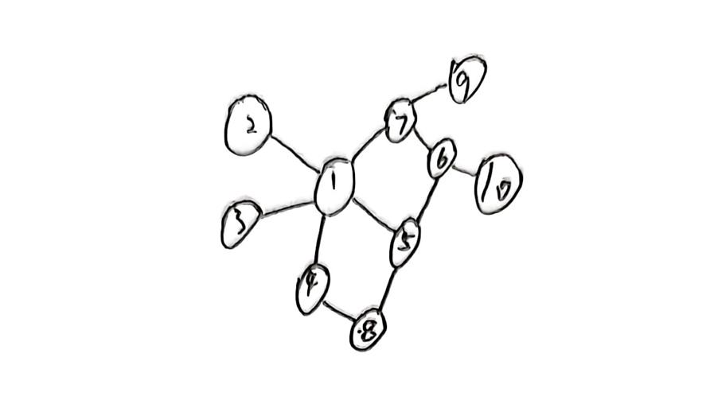
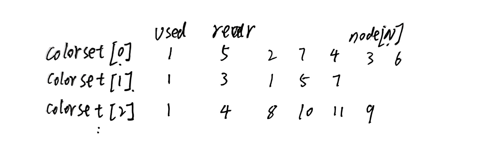
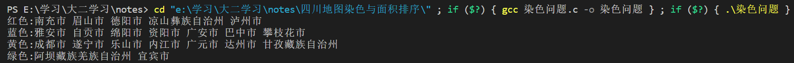

# 四色算法染色

 电子信息四班  姚鑫  12107980106 本次染色采用四川省地图，以地级市为最小单位，共计21个地级市和自治州。

## 一、建立数据模型

对地图进行抽象，发现逻辑关系为**图**且为无向图，其特征是数据元素间存在多对多关系的数据结构。
逻辑结构示意图：


## 二、存储结构设计

1. ==输入==
由于邻接矩阵，易判断两点间的关系，容易求得顶点的度，所以选择邻接矩阵作为输入的存储结构。由人工手动整理出邻接矩阵，见附件：地图邻接矩阵.xlsx。
2. ==计算==
采用结构体存储染色结果。将相同颜色的顶点放在同一个数组node[N]中，数组中已有顶点的最后位置由尾指针rear记录，颜色是否使用由used记录，0为未用，1为已用。

```c
struct OrderNode
{
	int used;     //标记次序是否被用，0代表未用
	int rear;     //顶点集合尾指针
	int node[N];  //同次序顶点集合
}OrderSet[N]={{0,0,0,0}};  //顶点集
```

## 三、函数接口设计

```c
int Max(int *a);
```

函数功能：找到度最大的结点的下表。
输入：结点度数数组。
输出：度最大的结点下标。

```c
int judge(int i,int k);
```

函数功能：判断k点是否能加入颜色集中第i中颜色顶点集。
输入：第i种颜色，第k个结点。
输出：1可以加入，0不能加入。

```c
void Welsh_Powell()
```
函数功能：实现韦尔奇-鲍威尔图结点染色法。
函数输入：无。
输出：打印输出同色城市。

## 四、算法设计

1. 分析：按照 “度” 的从大到小排序，然后依次染色，每个结点都尝试第一种颜色，若与已染色的点冲突，则用第二种（直到不冲突为止），这种染色算法就是韦尔奇 鲍威尔染色法。
2. 伪代码：
   1. 将图的结点按照结点度数一次递减的次序排列。
   2. 用第一种颜色对尚未被染色中度数最大的结点染色，并对该结点不相邻的结点染上相同的颜色。
   3. 用第二种颜色重复步骤2，直到颜色用完或染色完成。
3. 细化：
   1. 计算度并放入数组degree[N]中。
   2. 在degree[N]中找到未染色度度最大结点，下标记录在k中，清除degree[N]中该结点。
   3. 颜色集中colorset[]的第i是否使用过？
   {
    若!(k与colorset[colorptr].node[]中的结点不相邻)
    则colorptr++
   }
   4. 将k加入结点集colorset[colorptr].node[]。
   5. 重复步骤2-4，直到染色完成。
   6. 输出同色城市集合。

## 五、编程及调试

### 1.源代码

```c
#include<stdio.h>
#define TRUE 1
#define FALSE 0
#define N 21
int AdjMatrix[N][N]={
	{0,0,0,0,1,0,0,0,0,0,0,1,0,0,0,1,0,1,1,0,0},
    {0,0,0,1,0,0,0,0,1,1,0,1,1,0,0,0,0,0,0,0,0},
    {0,0,0,0,0,0,0,0,0,0,0,0,0,0,0,0,0,0,0,0,1},
    {0,1,0,0,0,0,0,0,1,0,0,0,1,0,0,0,0,0,0,0,0},
    {1,0,0,0,0,1,0,1,0,0,0,0,0,0,0,0,0,1,1,0,0},
    {0,0,0,0,1,0,1,1,0,0,1,0,0,0,0,0,0,0,1,0,0},
    {0,0,0,0,0,1,0,0,0,0,1,0,0,0,0,0,1,0,0,0,0},
    {0,0,0,0,1,1,0,0,0,0,1,0,0,1,0,0,0,1,0,0,0},
    {0,1,0,1,0,0,0,0,0,0,0,1,0,0,0,0,0,1,0,0,0},
    {0,1,0,0,0,0,0,0,0,0,0,1,1,0,0,1,0,0,0,0,1},
    {0,0,0,0,0,1,1,1,0,0,0,0,0,1,1,0,1,0,0,0,0},
    {1,1,0,0,0,0,0,0,1,1,0,0,0,0,0,1,0,1,0,0,0},
    {0,1,0,1,0,0,0,0,0,1,0,0,0,0,0,0,0,0,0,0,1},
    {0,0,0,0,0,0,0,1,0,0,1,0,0,0,1,0,0,0,0,0,0},
    {0,0,0,0,0,0,0,0,0,0,1,0,0,1,0,0,1,0,0,0,0},
    {1,0,0,0,0,0,0,0,0,1,0,1,0,0,0,0,0,0,1,1,1},
    {0,0,0,0,0,0,1,0,0,0,1,0,0,0,1,0,0,0,0,0,0},
    {1,0,0,0,1,0,0,1,1,0,0,1,0,0,0,0,0,0,0,0,0},
    {1,0,0,0,1,1,0,0,0,0,0,0,0,0,0,1,0,0,0,1,0},
    {0,0,0,0,0,0,0,0,0,0,0,0,0,0,0,1,0,0,1,0,1},
    {0,0,1,0,0,0,0,0,0,1,0,0,1,0,0,1,0,0,0,1,0}};

int degree[N]={0};   //记录顶点的degree数目
char *order[N]={"红色","蓝色","黄色","绿色"};
char *name[N]={"成都市","自贡市","攀枝花市","泸州市","德阳市",
"绵阳市","广元市","遂宁市","内江市","乐山市",
"南充市","眉山市","宜宾市","广安市","达州市",
"雅安市","巴中市","资阳市","阿坝藏族羌族自治州","甘孜藏族自治州","凉山彝族自治州"};
int Max(int *a);//找度最大的结点下标
int judge(int i,int k);//判断k点是否能加入颜色集中第i中颜色顶点集
void Welsh_Powell();//韦尔奇 鲍威尔图结点染色法
struct OrderNode
{
	int used;     //标记次序是否被用，0代表未用
	int rear;     //顶点集合尾指针
	int node[N];  //同次序顶点集合
}OrderSet[N]={{0,0,0,0}};  //顶点集

int main()
{
	Welsh_Powell();
	return 0;
}
int Max(int *a)
{
	int i,value,index;
	value=-1;
	index=0;
	for(i=0;i<N;i++)
	{
		if(value<a[i])
		{
			value=a[i];
			index=i;
		}
	}
	a[index]=-1;
	return index;
}                     
int judge(int i,int k)
{
	int p,q,m;

	p=0;
	q=OrderSet[i].rear;
	while(AdjMatrix[k][OrderSet[i].node[p]]==0&&p!=OrderSet[i].rear)
		p++;
		if(p==q)
		return 1;
	return 0;
}                  
void Welsh_Powell()
{
	int i,k,j;
	int orderPtr;
	for(i=0;i<N;++i)
	{
		for(j=0;j<N;++j)
		{
			if(i!=j&&AdjMatrix[i][j])
				degree[i]++;
		}
	}

	for(j=0;j<N;++j)
	{
		k=Max(degree);
		orderPtr=0;
		if(OrderSet[orderPtr].used==1)
		{
			while(!judge(orderPtr,k))
				orderPtr++;
		}
		OrderSet[orderPtr].node[OrderSet[orderPtr].rear++]=k;
		if(OrderSet[orderPtr].used==0) OrderSet[orderPtr].used=1;
	}
	for(j=0;j<N;++j)
	{
		if(OrderSet[j].used==1)
		{
			printf("%s:",order[j]);
			for(i=0;i<OrderSet[j].rear;++i)
				printf("%s ",name[OrderSet[j].node[i]]);
			printf("\n");
		}
	}
}                        

```

### 2. 运行结果截图



## 六、总结

韦尔奇 鲍威尔图结点染色法是一种贪心算法，即用尽可能少的颜色染完地图，下面我介绍一种均衡分配四种颜色的算法。

```c
void color(int AdjMatrix[N][N],int color[N])
{
	int i,j,k;
	for (i=0;i<=N;i++)
	{
		for(j=1;j<=4;j++)//对每个城市尝试染色
		{
			color[i]=j;//染色
			for(k=1;k<i;k++)//检查是否与相邻城市相同
			{
				if(AdjMatrix[i][k]==1&&color[k]==color[i])
				break;//若相同则跳出并尝试下一种颜色
			}
				if(k>=i)
				break;//若不同则进行下一个城市
		}
	}
}
```

# 面积排序

## 一、选择排序

1. 特点：一开始在0-n-1的区间内选择一个最小值，将其放在位置0，然后在1-n-1的区间内选择一个最小值，放在位置1，重复该过程，直到剩下最后一个元素，即排序完成。
2. 复杂度分析
   1. 时间复杂度：最坏:$O(n^2)$,最好:$O(n)$,平均:$O(n^2)$。
   2. 空间复杂度：$O(1)$。

## 二、核心代码

```c
void selection_sort(int a[], int len) 
{
    int i,j,temp;
    for (i = 0 ; i < len - 1 ; i++) 
    {
        int min = i;// 记录最小值，第一个元素默认最小
        for (j = i + 1; j < len; j++)// 访问未排序的元素
        {
            if (a[j] < a[min])// 找到目前最小值
            {
                min = j;// 记录最小值
            }
        }
        if(min != i)
        {
            temp=a[min];// 交换两个变量
            a[min]=a[i];
            a[i]=temp;
        }
    }
}
```
## 三、源代码

```c
#include<stdio.h>
#define N 21

void selection_sort(int a[], int len);
void putname(int t);//输出城市
int main()
{
int a[N]={85131,12292,14312,16605,5911,152629,6344,16310,12759,60423,12232,7134,20257,12514,5386,7440,5326,15303,13271,5757,4382,};
/*char *name[N]={"阿坝州","巴中市","成都市","达州市","德阳市","甘孜州","广安市","广元市","乐山市","凉山州",
"泸州市","眉山市","绵阳市","南充市","内江市","攀枝花市","遂宁市","雅安市","宜宾市","资阳市","自贡市"};*/
int i;
selection_sort(a, N);
printf("the right sort is :");
for(i=0;i<N;i++)
{   
    putname(a[i]);
    printf("%d<",a[i]);
}
    return 0;
}

void selection_sort(int a[], int len)//选择排序
{
    int i,j,temp;
    for (i = 0 ; i < len - 1 ; i++) 
    {
        int min = i;// 记录最小值，第一个元素默认最小
        for (j = i + 1; j < len; j++)// 访问未排序的元素
        {
            if (a[j] < a[min])// 找到目前最小值
            {
                min = j;// 记录最小值
            }
        }
        if(min != i)
        {
            temp=a[min];// 交换两个变量
            a[min]=a[i];
            a[i]=temp;
        }
    }
}
void putname(int t)
{
    switch(t)
    {
        case 85131:printf("阿坝州：");break;
        case 12292:printf("巴中市：");break;
        case 14312:printf("成都市：");break;
        case 16605:printf("达州市：");break;
        case 5911:printf("德阳市：");break;
        case 152629:printf("甘孜州：");break;
        case 6344:printf("广安市：");break;
        case 16310:printf("广元市:");break;
        case 12759:printf("乐山市:");break;
        case 60423:printf("凉山州:");break;
        case 12232:printf("泸州市:");break;
        case 7134:printf("眉山市:");break;
        case 20257:printf("绵阳市:");break;
        case 12514:printf("南充市:");break;
        case 5386:printf("内江市:");break;
        case 7440:printf("攀枝花市:");break;
        case 5326:printf("遂宁市:");break;
        case 15303:printf("雅安市:");break;
        case 13271:printf("宜宾市:");break;
        case 5757:printf("资阳市:");break;
        case 4382:printf("自贡市:");break;
		default:printf("unknown");break;
    }
}

```

## 四、运行结果


# 分析总结

1. 地图染色
   1. **问题抽象**：将形象的地图染色问题抽象为图的染色问题。给该图的每个顶点染色，使相邻的顶点染上不同的颜色。便于之后模型的建立。
   1. **数据存取**：本着存数值，存联系；存得进，取得出的原则。
   采用邻接矩阵对无向图的关系进行存储输入，优点是易判断两点间的关系，容易求得顶点的度，缺点是占用空间大，空间复杂度为$O(n^2)$。采用结构体数组存储染色结果。
   2. **算法设计**：使用伪代码的形势对算法逻辑进行描述。
   采用韦尔奇 鲍威尔图结点染色法可以有效的对地图染色，并且保证颜色最少，之后提到的另外一种算法可以均衡的使用四种颜色对地图染色。时间复杂度均为$O(n^2)$。
   四色地图染色是一种组合优化问题，对考试、比赛安排都可以抽象为同一种模型，可以用类似方法解决。
1. 排序算法
   1. 本次选择三种简单排序（冒泡，选择，直接插入）中的**选择排序**。
   2. 简单选择排序是最简单直观的一种算法，基本思想为每一趟从待排序的数据元素中选择最小（或最大）的一个元素作为首元素，直到所有元素排完为止，简单选择排序是不稳定排序。
   3. 之后可优化为**堆排序**，因为堆排序与选择排序的核心逻辑相同。
3. 学习体会
   1. 透彻地理解数值与非数值问题的差异和共性，学会从**实际问题**中抽象出不同类型数据对象的特征，确定对应的数据组织方法（逻辑结构），选择适当的存储结构，归纳出对不同类型数据对象相应的处理算法，进而完成软件系统的设计，培养了良好的程序设计风格和技能。
   2. 学会了算法效率（时间复杂度）的分析。
   3. 在学习过程中清楚地认识到数据与算法(系统)在软件中的相互关系，更全面地提升利用计算机作为工具解决实际问题的能力。

