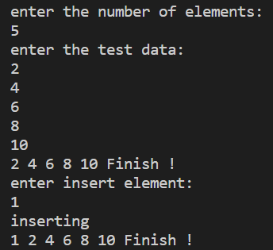

电子信息四班 姚鑫 12107980106

# 题目

设有一顺序表，单链表中按整数递增处理，将X的值插入表L，使L仍有序。

## 一、数据结构

1. **结构说明**此时数据的逻辑结构为线性结构，储存结构为链式结构
2. **变量说明**使用typedef int ElemType;为int 起了一个别名，提高程序可读性，且便于修改。
LNode为所构建的结构体的变量名，n为元素长度，m为插入元素，
pr为int型的指针，用于接收动态数组。
C为LNode类型的指针，用于接收创建的链表的头结点指针。
3. **函数说明**initlist(ElemType a[],int n);用于建立一个有n个结点的链表，用数组a[]中的元素进行赋值，并会返回一个linklist类型的指针。
inserlist（linklist L,int m）;用于将元素m按序插入到链表L中，无返回值。
printlist（linklist L）;用于输出元素。

## 二、测试样例

* 使用数组接收一定数量的顺序元素（用户自行输入）。然后选择边界值，中间值，进行插入。无异常值情况。

## 三、核心算法

* 由于是链式存储，且单向读取，只能遍历单链表，寻找插入位置。然后将结点插入其中即可。

**例：**

>a b c d f g,将e插入其中，原本d->next指向g，现在改为d->next指向e，e->next指向f。

单链表顺序插入伪代码：

| 顶部伪代码描述 | 第一步细化 |第二步细化|
| ---- | ---- |----|
| 在单链表中按序插入元素 | 采用循环在链表中寻找插入位置 |if((m>=p->data)&&(m<=p-next->data))|
||为元素申请一个结点s并赋值| LNode * s=(LNode *)malloc(sizeof(LNode));s->data = m;|
||将s结点与p的后继点链接|s->next = p->next;|
||将p的后继改为s|p->next = s;|
||插入成功后跳出循环|break；|
```c
void inserlist(linklist L,int m)
{
    linklist p = L;
    while(p->next)
    {
        if((m>=p->data)&&(m<=p->next->data))//寻找插入位置
        {
            LNode *s = (LNode*)malloc(sizeof(LNode));
            s->data = m;//赋值
            s->next = p->next;//链接
            p->next = s;
            break;//插入完成后无需判断后续元素，故跳出循环
        }
        else
        {
            p = p->next;
        }
    }
}
```

## 四、测试结果

1. 边界值


2. 中间值


## 五、完整代码

```c
#include<stdio.h>
#include<malloc.h>
typedef int ElemType;
typedef struct LNode
{
    ElemType data;
    struct LNode *next;
}LNode,*linklist;//前者代表结点，后者代表链表

linklist initlist(ElemType a[],int n);//建立链表
void inserlist(linklist L,int m);//插入元素
void printlist(linklist L);//输出元素
int main()
{
    int n = 0;//数组长度
    int m = 0;//插入元素
    int *pr;
    linklist C;
    printf("enter the number of elements:\n");
    scanf("%d",&n);
    pr = (int *)malloc(sizeof(int)*n);//c99已支持动态数组
    printf("enter the test data:\n");
    for(int i = 0;i<n;i++)
       { 
            scanf("%d",&pr[i]);
       }
    C = initlist(pr,n);
    free(pr);
    printlist(C);
    printf("enter insert element:\n");
    scanf("%d",&m);
    inserlist(C,m);
    printf("inserting\n");
    printlist(C);
    return 0;
}
linklist initlist(ElemType a[],int n)
{
    LNode *head,*p,*q;
    head = (LNode*)malloc(sizeof(LNode));
    head->next = NULL;//头结点赋空
    p = head;
    for(int i = 0;i <=n;i++)
    {
        q = (LNode*)malloc(sizeof(LNode));//生成一个结点
        q->data = a[i];//赋值
        p->next = q;
        p = q;//链接
    }
    p->next = NULL;
    return head;
}
void inserlist(linklist L,int m)
{
    linklist p = L;
    while(p->next)
    {
        if((m>=p->data)&&(m<=p->next->data))//寻找插入位置
        {
            LNode *s = (LNode*)malloc(sizeof(LNode));
            s->data = m;//赋值
            s->next = p->next;//链接
            p->next = s;
            break;//插入完成后无需判断后续元素，故跳出循环
        }
        else
        {
            p = p->next;
        }
    }
}
void printlist(linklist L)
{
    LNode *p = L->next;//跳过头结点
    while(p->next)
    {
        printf("%d ",p->data);
        p = p->next;
    }
    printf("Finish ! \n");
}
```
